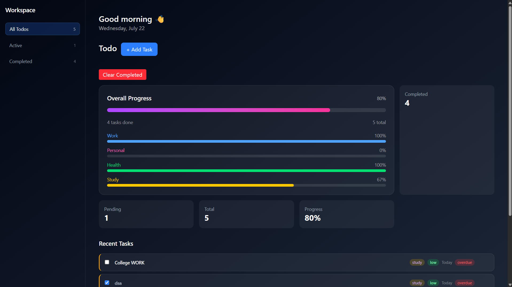

# 📝 Todo Application

A modern and responsive **Todo Application** built using **React.js**, **Tailwind CSS**, **Context API**, and **Framer Motion**. The application helps users efficiently organize and manage daily tasks with features like drag-and-drop, task categorization, priorities, due dates, keyboard shortcuts, and local storage persistence.

---


## 📸 Preview



## 🌐 Live Demo

🔗 **https://todo-app-alic.vercel.app**

---

## ✨ Features

- ✅ Create, edit, and delete tasks
- ✅ Mark tasks as completed
- ✅ Drag & Drop task reordering
- ✅ Task Categories
- ✅ Priority Levels (Low, Medium, High)
- ✅ Due Dates
- ✅ Search Tasks
- ✅ Filter by Status & Category
- ✅ Command Palette (`Ctrl + K`)
- ✅ Local Storage Persistence
- ✅ Responsive Design
- ✅ Smooth Animations using Framer Motion

---

## 🛠 Tech Stack

### Frontend
- React.js
- JavaScript (ES6+)
- Tailwind CSS

### Libraries
- Framer Motion
- @hello-pangea/dnd

### Build Tool
- Vite

### State Management
- Context API
- React Hooks

---


## 🚀 Installation

### Clone the Repository

```bash
git clone https://github.com/LIGHT-YAGAMI-61/Todo-App.git
```

### Navigate to Project

```bash
cd Todo-App
```

### Install Dependencies

```bash
npm install
```

### Start Development Server

```bash
npm run dev
```

---

## 📂 Project Structure

```
Todo-App/
│
├── public/
├── src/
│   ├── components/
│   ├── context/
│   ├── hooks/
│   ├── utils/
│   ├── assets/
│   ├── App.jsx
│   └── main.jsx
│
├── package.json
├── vite.config.js
└── README.md
```

---

## 🎯 Future Improvements

- User Authentication
- Cloud Database Integration
- Dark Mode
- Notifications & Reminders
- Recurring Tasks
- Team Collaboration
- Export & Import Tasks

---

## 👨‍💻 Author

**Harsh Yadav**

- GitHub: https://github.com/LIGHT-YAGAMI-61
- LinkedIn: https://www.linkedin.com/in/harsh-yadav-b1b831383

---

## ⭐ Support

If you found this project useful, consider giving it a **⭐ Star** on GitHub.
